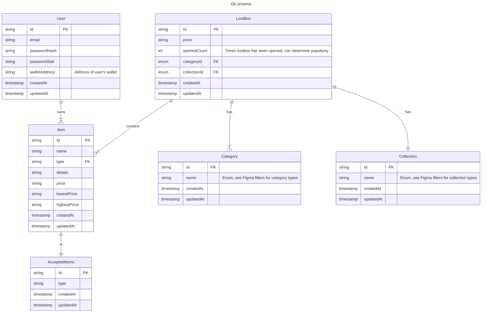

```mermaid
---
title: Db schema
---

erDiagram
  User {
    string Id PK
    string email
    string passwordHash
    string passwordSalt
    string walletAddress "Address of user's wallet"
    timestamp createdAt
    timestamp updatedAt
  }

  LootBox {
    string Id PK
    string price
    int openedCount "Times lootbox has been opened, can determine popularity"
    enum categoryId FK
    enum collectionId FK
    timestamp createdAt
    timestamp updatedAt
  }

  LootBox one to one or more Item : contains

  User only one to one or more Item : owns

  Item {
    string Id PK
    string name
    string type FK
    string details
    string price
    string lowestPrice
    string highestPrice
    timestamp createdAt
    timestamp updatedAt
  }

  Category {
    string Id PK
    string name "Enum, see Figma filters for category types"
    timestamp createdAt
    timestamp updatedAt
  }

  LootBox one to one or more Category : has

  Collection {
    string Id PK
    string name "Enum, see Figma filters for collection types"
    timestamp createdAt
    timestamp updatedAt
  }

  LootBox one to one Collection : has

  AcceptedItems {
    string Id PK
    string type
    timestamp createdAt
    timestamp updatedAt
  }

  Item one to one AcceptedItems : is
```
