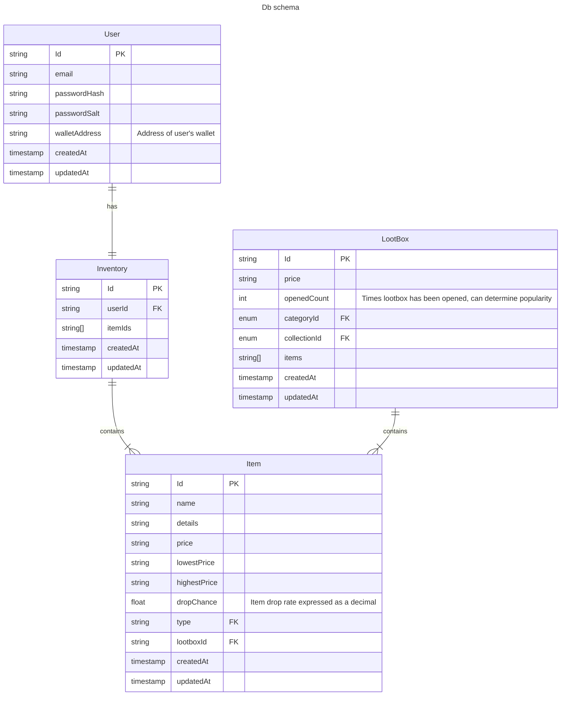

```mermaid
---
title: Db schema
---

erDiagram
  User {
    string Id PK
    string email
    string passwordHash
    string passwordSalt
    string walletAddress "Address of user's wallet"
    timestamp createdAt
    timestamp updatedAt
  }

  Inventory {
    string Id PK
    string userId FK
    string[] itemIds
    timestamp createdAt
    timestamp updatedAt
  }

  User one to one Inventory : has

    Item {
    string Id PK
    string name
    string details
    string price
    string lowestPrice
    string highestPrice
    float dropChance "Item drop rate expressed as a decimal"
    string type FK
    string lootboxId FK
    timestamp createdAt
    timestamp updatedAt
  }

  Inventory one to one or more Item : contains

  LootBox {
    string Id PK
    string price
    int openedCount "Times lootbox has been opened, can determine popularity"
    enum categoryId FK
    enum collectionId FK
    string[] items
    timestamp createdAt
    timestamp updatedAt
  }

  LootBox one to one or more Item : contains
```
