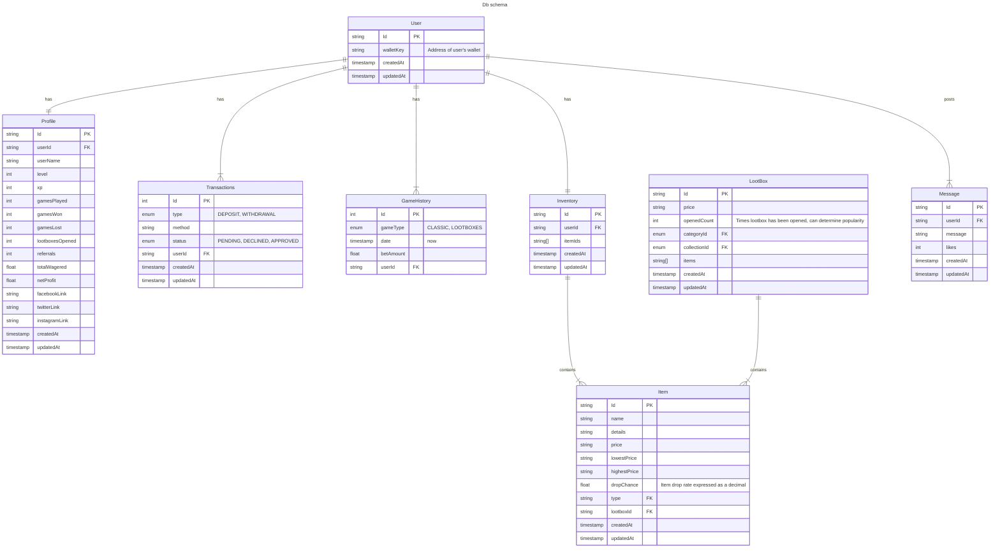

```mermaid
---
title: Db schema
---

erDiagram
  User {
    string Id PK
    string walletKey "Address of user's wallet"
    timestamp createdAt
    timestamp updatedAt
  }

  Profile {
    string Id PK
    string userId FK
    string userName
    int level
    int xp
    int gamesPlayed
    int gamesWon
    int gamesLost
    int lootboxesOpened
    int referrals
    float totalWagered
    float netProfit
    string facebookLink
    string twitterLink
    string instagramLink
    timestamp createdAt
    timestamp updatedAt
  }

  User one to one Profile : has

  Transactions {
    int Id PK
    enum type "DEPOSIT, WITHDRAWAL"
    string method
    enum status "PENDING, DECLINED, APPROVED"
    string userId FK
    timestamp createdAt
    timestamp updatedAt
  }

  User one to one or more Transactions : has

  GameHistory {
    int Id PK
    enum gameType "CLASSIC, LOOTBOXES"
    timestamp date "now"
    float betAmount
    string userId FK
  }

  User one to one or more GameHistory : has

  Inventory {
    string Id PK
    string userId FK
    string[] itemIds
    timestamp createdAt
    timestamp updatedAt
  }

  User one to one Inventory : has

    Item {
    string Id PK
    string name
    string details
    string price
    string lowestPrice
    string highestPrice
    float dropChance "Item drop rate expressed as a decimal"
    string type FK
    string lootboxId FK
    timestamp createdAt
    timestamp updatedAt
  }

  Inventory one to one or more Item : contains

  LootBox {
    string Id PK
    string price
    int openedCount "Times lootbox has been opened, can determine popularity"
    enum categoryId FK
    enum collectionId FK
    string[] items
    timestamp createdAt
    timestamp updatedAt
  }

  LootBox one to one or more Item : contains

  Message {
    string Id PK
    string userId FK
    string message
    int likes
    timestamp createdAt
    timestamp updatedAt
  }

  User only one to one or more Message : posts
```
