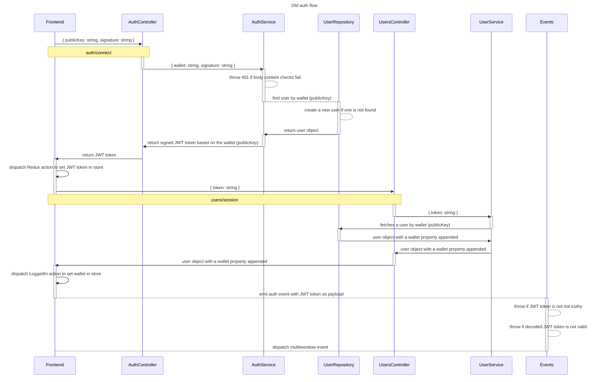

# Authentication Flow

## Old auth flow

1. Frontend:
   - `SignWallet.tsx`, when publicKey changes, a useEffect is called that calls `onClick()`
   - onClick() calls in BE /auth/connect with the following body:
     - `publicKey` (string)
     - signature (string)

2. Backend:
   - `/auth/connect` is called, which calls a service method
     - it receives a body with the following:
       - `wallet` (string), previously `publicKey`
       - `signature` (string)
   - that service:
     - first verifies the public key, decoded signature, and message, and returns a boolean
     - if falsy, return 401
     - if truthy
       - we fetch a user wallet with the payload.wallet(publicKey)
         - if we do not get a user back, we create one using that data from the payload and a generated name
         - if we do get a user back, we return an object that contains a JWT token with the signed payload.wallet

3. Frontend:
   - once the response is received, we dispatch a Redux action that sets the JWT token in the store
   - we call `processLogin()` with the JWT `token: string`
   - calls the backend with the token

4. Backend
   - `/users/session` is called with the JWT token as a bearer token header
   - calls the user service with the wallet of the currently logged in user if the guard passes
   - finds a user by the wallet
      - if no user is found, nothing happens because this is a terrible piece of software engineering
      - if user is found, return the user object with the wallet appended in the object

5. Frontend
   - fetches the user object from the backend
   - assigns a default clan
   - assigns a default user profile picture
   - dispatches a Redux action that sets the user object in the store, called wallet for some reason
   - emits an `auth` event with the JWT token as the payload

6. Backend

